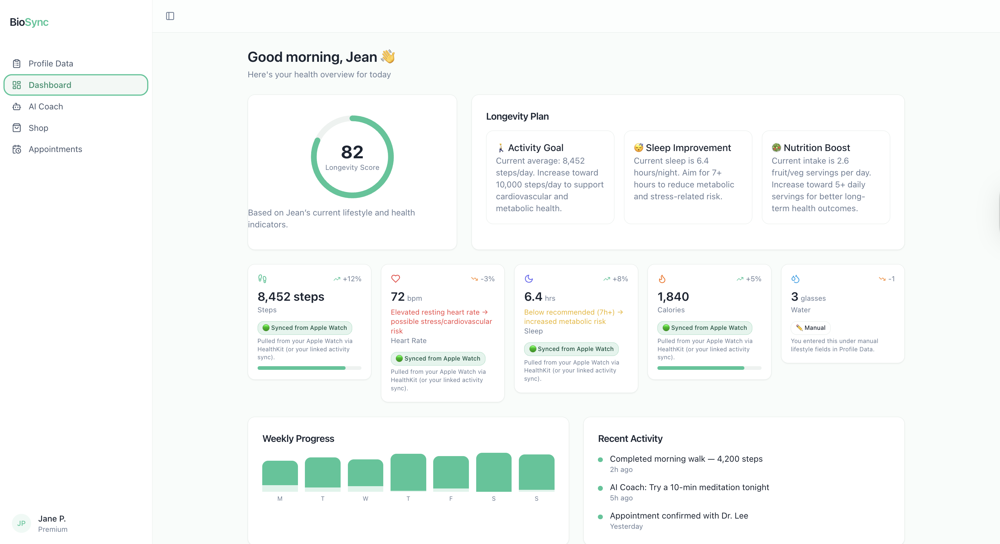
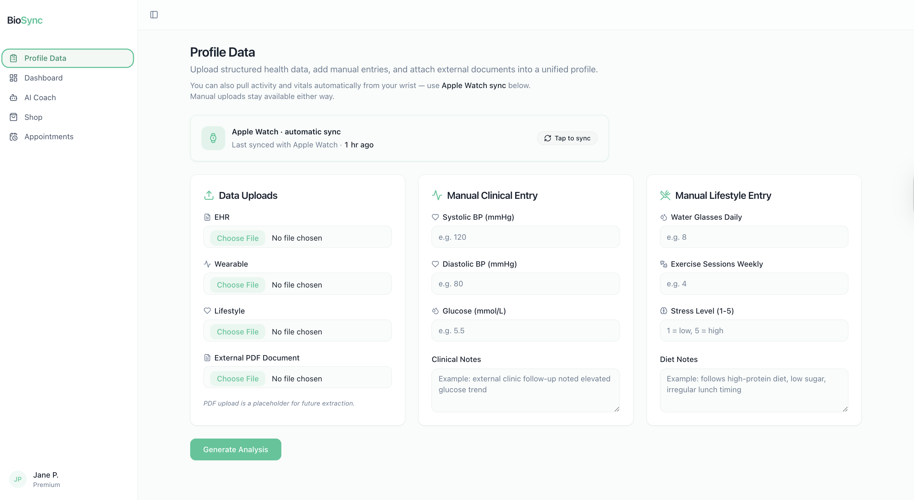
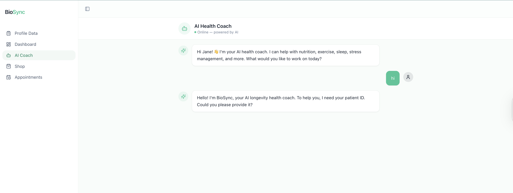
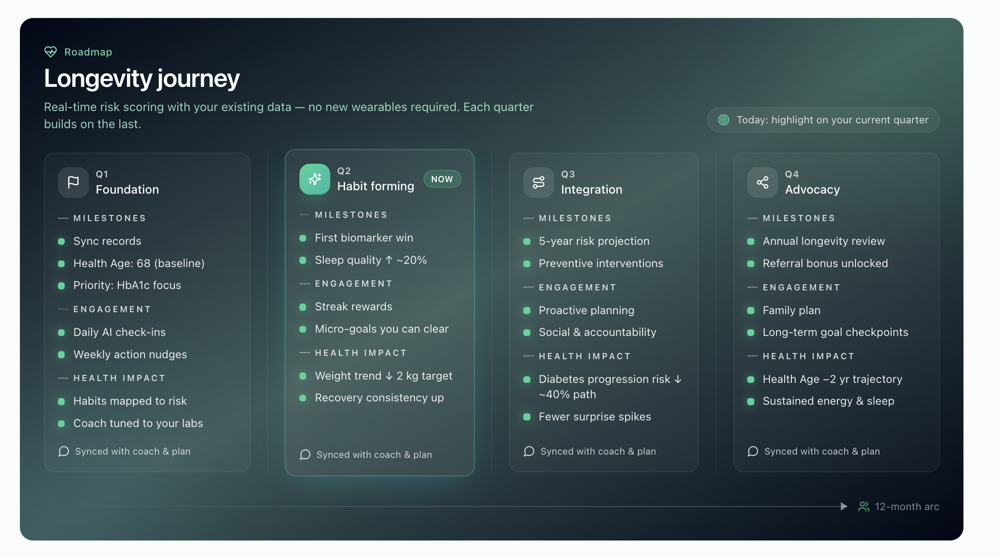
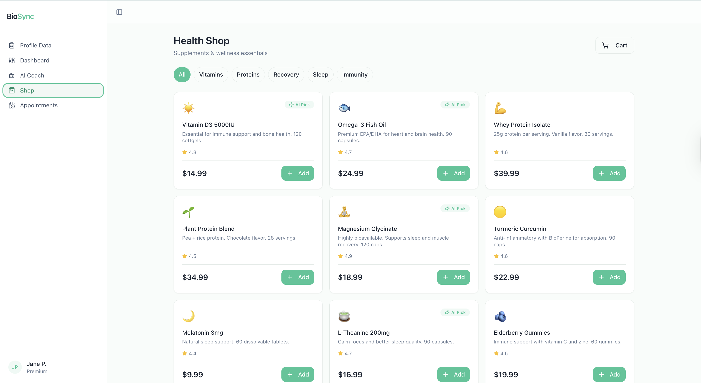
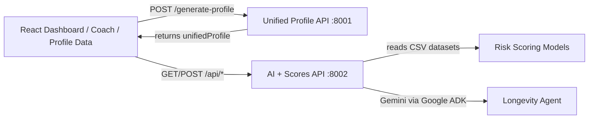

# BioSync — Your Longevity Co‑Pilot

BioSync is a **preventive health dashboard + AI coach** that turns existing health inputs (wearables + uploads + manual entries) into a **clear, source-labeled daily view** and a **12‑month longevity journey** you can actually follow.

**What makes it competition-ready:** it’s opinionated about trust. Every metric shows **where it came from** (Synced vs Manual), Profile Data highlights **automatic Apple Watch sync**, and the backend provides both **deterministic risk scoring** and an **LLM coach** for narrative guidance.

---

## Why this matters

Most “health dashboards” feel like spreadsheets. BioSync focuses on:

- **Clarity**: metric tiles explicitly label data provenance (Synced / Manual).
- **Actionability**: a “longevity journey” turns risk + biomarker progress into quarterly milestones.
- **Practicality**: works with existing datasets and uploads; no new sensors required to start.

---

## What’s inside

### Frontend (React + Vite + shadcn/ui)
- **Dashboard**: longevity score ring, metric tiles with **data source badges**, weekly progress, activity feed, and a vibrant **Longevity Journey** timeline.
- **AI Coach**: conversational UI that calls the backend `/api/chat`.
- **Profile Data**: upload CSV/PDF + manual entries **and** an “Apple Watch automatic sync” strip with a **Last Synced** timestamp and tap-to-sync behavior.

### Backends (FastAPI)
1) **Unified Profile service** (`backend/unified_profile`, port **8001**)  
   Accepts uploads + manual fields and builds a single `unifiedProfile` object used by the UI.

2) **AI + Scores service** (`backend/ai-and-scores`, port **8002**)  
   - Deterministic scoring endpoints (bio age, CVD risk, lifestyle, sleep) computed from CSVs.
   - AI chat endpoint that runs the Gemini-powered Longevity Agent.

---

## Screenshots

Add your screenshots to `docs/screenshots/` and they will render here on GitHub.

| Dashboard | Profile Data (Auto Sync + Manual Uploads) |
| --- | --- |
|  |  |

| AI Coach | Longevity Journey |
| --- | --- |
|  |  |

| Health Shop (optional) |
| --- |
|  |

> Tip: keep images ~1400px wide for crisp rendering.

---

## Quickstart (3 terminals)

### 0) Prereqs
- **Node.js** (recommended: latest LTS)
- **Python 3.11+** (project currently runs with Python 3.13 as well)

### 1) Frontend

```bash
cd BioSync
npm install
npm run dev
```

Vite will print a local URL (typically `http://localhost:5173`).

### 2) Unified Profile API (uploads + manual entry)

```bash
cd BioSync/backend/unified_profile
python3 -m pip install -r requirements.txt
uvicorn app:app --reload --port 8001
```

### 3) AI + Scores API (risk scoring + AI chat)

```bash
cd BioSync/backend/ai-and-scores
python3 -m pip install -r requirements.txt

# Gemini key (required for /api/chat)
# Option A (recommended): .env file (this repo ignores .env via .gitignore)
echo 'GOOGLE_API_KEY=YOUR_KEY_HERE' > .env

# Option B: shell env var
# export GOOGLE_API_KEY="YOUR_KEY_HERE"

uvicorn main:app --reload --port 8002
```

Open the app and navigate via the sidebar: **Profile Data → Dashboard → AI Coach**.

---

## API overview

### Unified Profile (port 8001)
- `GET /` — health check
- `POST /generate-profile` — multipart upload + manual fields → returns `{ profile: ... }`

### AI + Scores (port 8002)
- `GET /api/health` — health check + dataset loaded count
- `GET /api/patients` — lists patient IDs
- `GET /api/scores/all?patient_id=PT0001` — all four score dimensions for a patient
- `POST /api/chat` — AI coach

Example:

```bash
curl -X POST http://127.0.0.1:8002/api/chat \
  -H 'Content-Type: application/json' \
  -d '{"patient_id":"PT0001","message":"Give me one actionable tip today.","session_id":null}'
```

**Note on quotas:** Gemini can return `429` (rate limit) or `503` (high demand). The API maps these to clean HTTP errors so the UI can prompt a retry.

---

## Product highlights (for judges)

- **Trust by design**: dashboard tiles label where the data came from (Synced vs Manual) so users don’t confuse synthetic/manual inputs with device-derived values.
- **Automatic vs manual**: Profile Data intentionally showcases both:
  - manual upload & entry panels
  - a prominent **Apple Watch sync** strip with **Last Synced** and tap-to-sync
- **Longevity Journey**: a visually engaging, quarterly roadmap with milestones + engagement prompts + expected health impact.
- **Two-layer intelligence**:
  - deterministic scoring (fast, explainable)
  - LLM agent for natural-language coaching and a structured 1‑year plan format

---

## Architecture (high level)



---

## Repo structure

- `src/` — React app (dashboard + coach + profile data)
- `backend/unified_profile/` — upload + manual ingestion service
- `backend/ai-and-scores/` — scoring endpoints + AI agent chat

---

## Security / keys

- **Do not commit API keys.** This repo ignores `.env` by default.
- Set your Gemini key via `GOOGLE_API_KEY` (preferred) or `API_KEY` (fallback).

---

## Demo flow (60–90 seconds)

1) Open **Profile Data** → tap **Apple Watch sync** (watch the Last Synced update)
2) Switch to **Dashboard** → see metrics labeled **Synced from Apple Watch** and the **Longevity Journey**
3) Open **AI Coach** → ask for “my top 2 priorities this week” → get a coached, structured response

---

## Troubleshooting

- **CORS / fetch errors**: ensure both APIs are running on `:8001` and `:8002`.
- **`/api/chat` returns 429/503**: wait 10–30 seconds and retry; free-tier limits can be strict.
